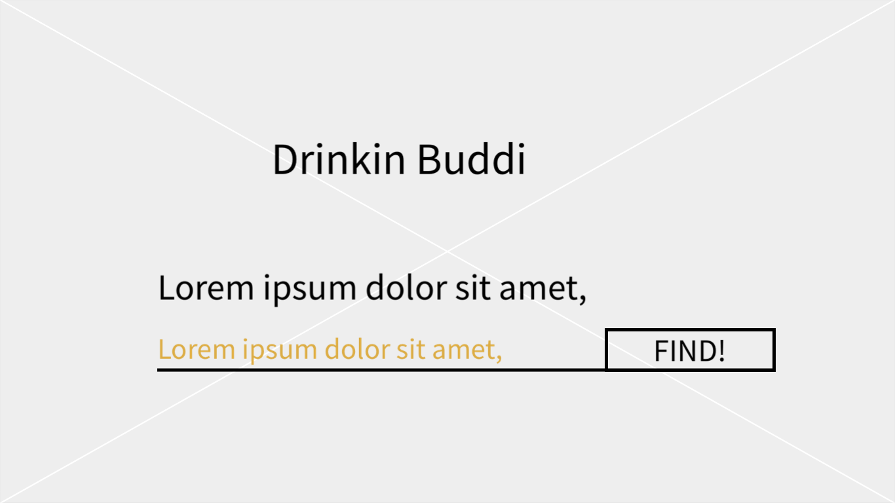
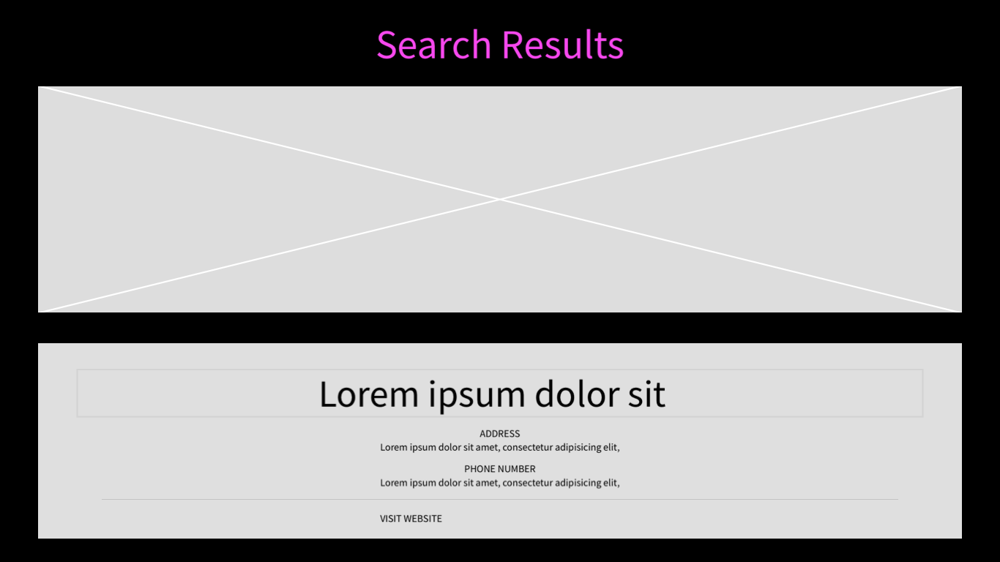
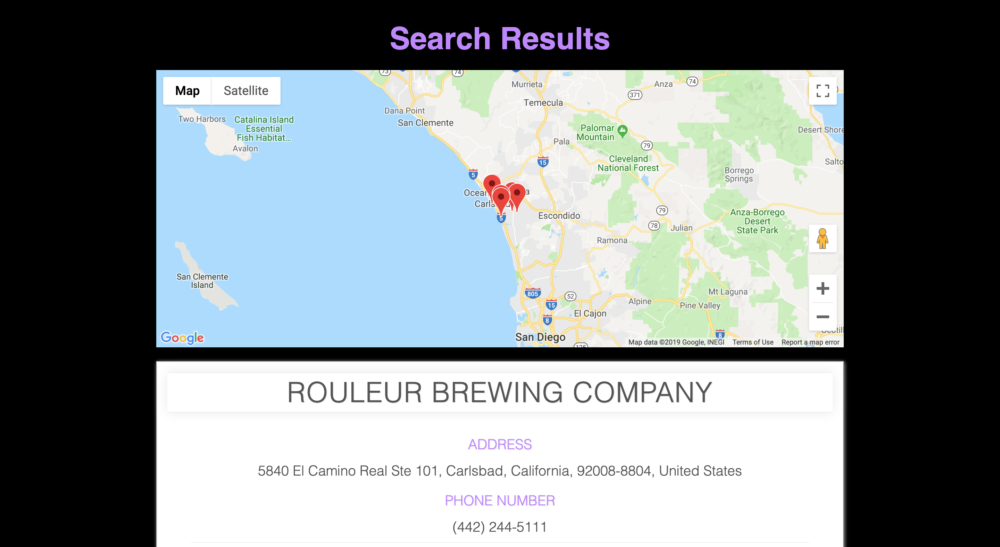

# Drinkin-Buddi.IO

Drinkin Buddi offers information related to breweries, cideries and bottle shops across the USA by city.

## Motivation

I wanted a brewery location and recommendation app. Users can find new breweries in their own city or a city they are visiting in the USA.

## Wireframes

## Screenshots
Landing Page:

Results Page:

## Built With

### Front-End
* HTML
* CSS
* JavaScript
* jQuery

## Demo

- [Live Demo](https://w00dh0use.github.io/drinkinbuddi/)

## GitHub Repo

- [Repo](https://github.com/W00DH0USE/drinkinbuddi)

## Authors

* **Iyron Woodhouse** - ** - Front-End development/testing, styling

## Acknowledgments

* **Open Brewery DB** - ** - A free API for public information on breweries
